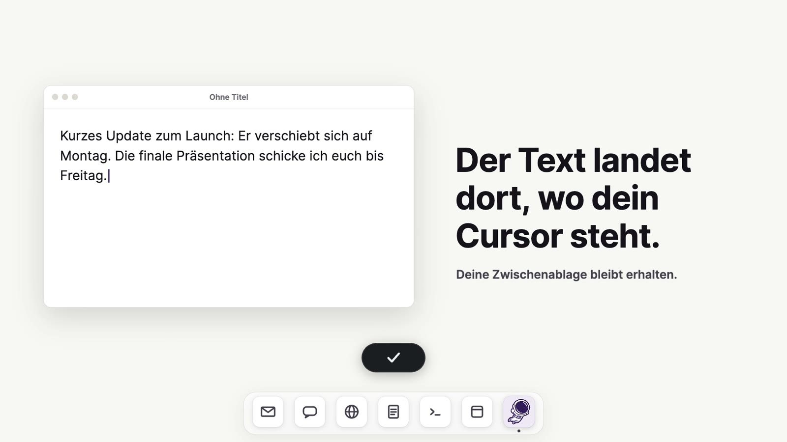
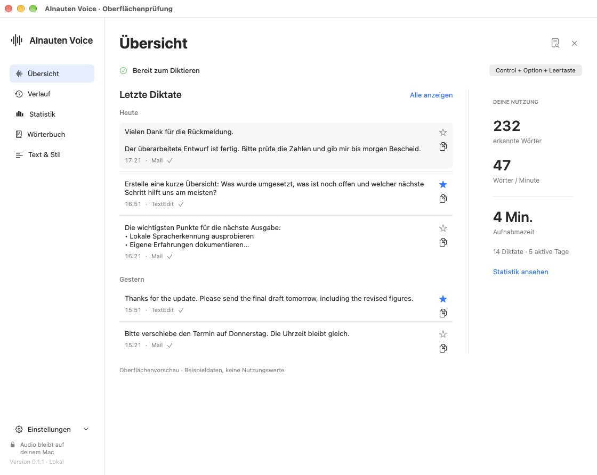
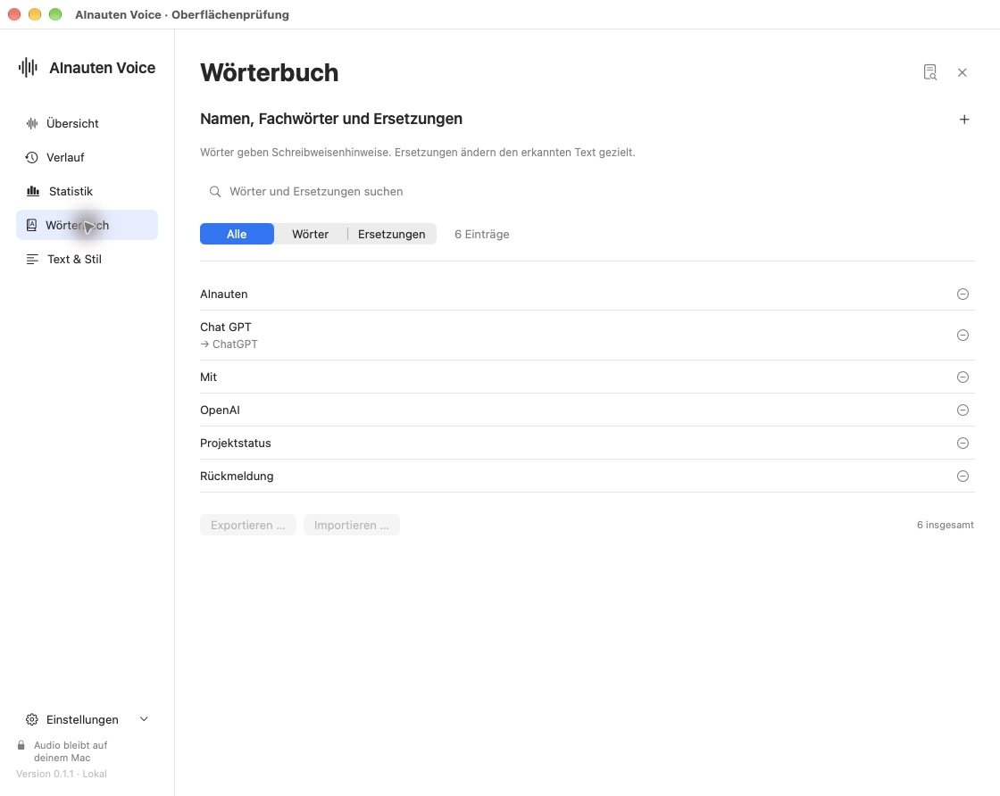
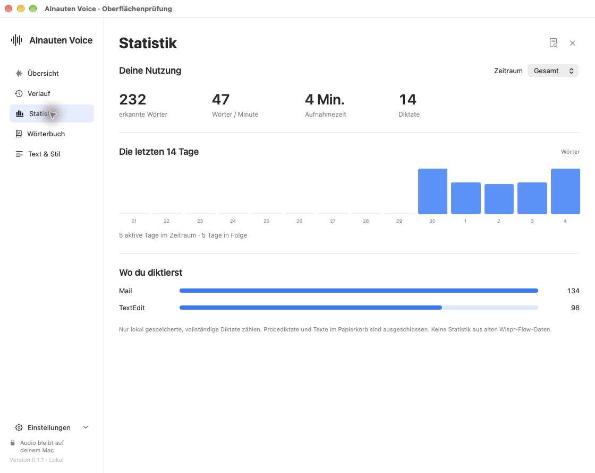

# AInauten Voice

**Sprechen statt tippen. Lokal auf deinem Mac.**

Eine native Diktier-App für Apple Silicon: Kürzel halten, sprechen, loslassen. Der Text landet im aktiven Feld. Spracherkennung und Textoptimierung laufen lokal.

[Website & Download](https://voice.ainauten.com/) · [Quellcode](https://github.com/MediaPublishing/ainauten-voice) · [Installation](#installation) · [Entwicklung](#entwicklung) · [Prüfstand](native/docs/verification-report.md)

## In 36 Sekunden erklärt

[](https://youtu.be/UBhxxBohiMU)

**[▶ Video ansehen](https://youtu.be/UBhxxBohiMU)** · [Direkt auf der Website abspielen](https://voice.ainauten.com/#video)

*Deutsch, mit Ton. Die Website bietet zusätzlich deutsche Untertitel. Die Videografiken zeigen die Bedienung mit Beispieldaten; die Screenshots unten zeigen die echte App.*

## Die App



*Echte App-Oberfläche aus der isolierten Vorschau. Diktate und Nutzungszahlen sind Beispieldaten.*

## Im Alltag

- **Diktieren in anderen Apps:** Halten zum Sprechen, Loslassen zum Einfügen. Freihändig per Kürzel; Esc verwirft die Aufnahme.
- **Vier Textmodi:** Original, Optimiert, E-Mail und Chat. Manuell wählen oder einer App zuordnen.
- **Eigenes Wörterbuch:** Namen und Fachbegriffe bearbeiten, ausdrückliche Ersetzungen anlegen, CSV importieren/exportieren.
- **Von Wispr Flow wechseln:** Unterstützte Wörter, Ersetzungen, Sprachen und Kürzel übernehmen. Vorschau und Rückgängig; die Quelle bleibt unverändert.
- **Verlauf und Statistik:** Lokale Diktate suchen, wieder kopieren, als Favorit merken oder in den Papierkorb verschieben. Erkannte Wörter, Aufnahmezeit und Wörter pro Minute einsehen. Verlauf für neue Diktate ausschaltbar.
- **Zwischenablage schützen:** Beim bestätigten Einfügen per Cmd+V wird der vorherige Inhalt wiederhergestellt. Bei unklarem Ergebnis erscheint kurz ein kompaktes Fenster; Kopier-/Rückgängig-Aktionen sind verfügbar. Kein zweiter automatischer Einfügeversuch.

| Eigene Schreibweisen | Deine Nutzung |
|---|---|
|  |  |

## Installation

1. [AInauten Voice 0.1.1 für Apple Silicon herunterladen](https://voice.ainauten.com/downloads/AInauten-Voice-0.1.1-arm64.dmg).
2. DMG öffnen, **00 - ZUERST LESEN.html** lesen und **AInauten Voice.app** nach **Programme** ziehen. Die Anleitung funktioniert auch offline.
3. App öffnen. Modelle laden, Sprache wählen und Mikrofon sowie Bedienungshilfen erlauben. Die App zeigt ihren Speicherort und hilft bei den Freigaben.
4. Probediktat prüfen. Für den Umstieg den Wispr-Flow-Autostart ausschalten und Flow regulär beenden.

**Voraussetzungen:** Apple Silicon (M1 oder neuer), macOS 14+, mindestens 8 GB RAM, 16 GB empfohlen. Für Modelle/Entpacken mindestens 8 GB freien Platz einplanen. Modelle werden einmalig heruntergeladen; danach funktionieren Erkennung und lokale Optimierung offline. Intel-Macs, Windows und iPhone gehören nicht zu dieser Version.

**macOS blockiert den ersten Start?** Die Beta ist lokal signiert und noch nicht Apple-notarisiert. Klicke in der Warnung auf **Fertig (Done)**. Öffne dann **Systemeinstellungen → Datenschutz & Sicherheit (Privacy & Security)** und wähle neben AInauten Voice **Dennoch öffnen (Open Anyway)**. Bestätige anschließend **Öffnen (Open)**. Diese Option erscheint erst, nachdem du die App einmal aus Programme zu öffnen versucht hast. [Schritt-für-Schritt-Anleitung](https://voice.ainauten.com/installation.html), auch im DMG unter **00 - ZUERST LESEN**. Sicherheitsfunktionen nicht global abschalten. Bei Warnungen über eine beschädigte oder schädliche App gilt diese Anleitung nicht. Updates werden in der öffentlichen Beta derzeit manuell über den Download installiert.

Bereits installiertes Voice Wispr: Beende die alte App und ersetze sie durch AInauten Voice. Bundle-ID, Datenordner und Schlüsselbunddienste bleiben kompatibel; Wörterbuch, Einstellungen und Verlauf bleiben erhalten. Die neue App heißt sichtbar AInauten Voice, der bestehende Datenordner heißt weiterhin Voice Wispr.

## Datenschutz

Audio bleibt auf dem Mac und wird nicht als dauerhafte Aufnahme gespeichert. Diktattexte werden bei eingeschaltetem Verlauf lokal gespeichert. Den Verlauf kannst du ausschalten, exportieren oder zurücksetzen; Papierkorb und bereits gespeicherte Texte sind in der App sichtbar.

Cloud ist standardmäßig aus. Erst wenn du sie ausdrücklich aktivierst, wird transkribierter Text mit begrenztem Satzkontext und passenden Wörterbucheinträgen an die von dir konfigurierte OpenAI-kompatible Schnittstelle gesendet. Audio bleibt lokal. API-Schlüssel liegen im macOS-Schlüsselbund. Keine automatische Cloud-Ausweichroute.

## Technik und Prüfstand

SwiftUI/AppKit · FluidAudio 0.17.5 mit Parakeet v3 und Silero VAD · eingebettetes llama.cpp b11361 mit Qwen3-4B-Instruct-2507, Q4_K_M. Kein separater Python-, Ollama- oder Modellserver für die native App. Die Komponenten sind versionsgebunden; Modelllizenzen unterscheiden sich von Codelizenzen. [Lizenznachweise](native/Resources/Licenses/NOTICE.md) und [Modellmanifest](native/Sources/VoiceWisprCore/Resources/model-manifest.json).

243 automatisierte Vertragsfälle bestanden am 4. Oktober 2026. Lokale Modell-/Textprüfungen und begrenzte echte Einfügetests sind dokumentiert. Die vollständige Mikrofon-, App-, Langzeit- und Geschwindigkeits-Abnahme bleibt teilweise offen. Das ist eine praktische Beta, kein Anspruch auf fehlerfreie Erkennung. [Aktueller Prüfbericht](native/docs/verification-report.md).

## Quellcode und Versionen

Der Quellcode ist öffentlich einsehbar. README, Screenshots und Prüfstand sind ohne Anmeldung zugänglich. Die App verwendet lizenzierte Open-Source-Komponenten; die Veröffentlichung des eigenen Quellcodes erteilt selbst keine Open-Source-Lizenz. Die Lizenzhinweise stehen unten.

Der Download auf der Website ist die geprüfte Beta **0.1.1, Build 2**. Der Entwicklungsstand enthält zusätzlich einen vorbereiteten Sparkle-Updatekanal und eine standardmäßig ausgeschaltete Forschungs-Beta für visuelle Spracherkennung. Diese Funktionen sind nicht Bestandteil des aktuellen öffentlichen Downloads. Forschungsmodelle werden nicht mitgeliefert; ihre Nutzung unterliegt eigenen, teilweise nichtkommerziellen Lizenzen. [Hinweise zu Forschungsmodellen](native/lipreading_runtime/licenses/NOTICE-Research-Models.txt).

## Entwicklung

```bash
git clone https://github.com/MediaPublishing/ainauten-voice.git
cd ainauten-voice/native
python3 scripts/bootstrap.py
swift build -c release -j 4
python3 scripts/portable-checks.py
python3 scripts/package.py
```

Die native App liegt unter native/. Die ursprüngliche Python/Swift-Version im Repository-Root bleibt als Vorgänger erhalten; ihre Anleitung steht in [docs/legacy](docs/legacy/LocalWhisper-README.md). Module/Executable VoiceWispr und Bundle-ID com.mediapublishing.VoiceWispr sind aus Kompatibilitätsgründen unverändert.

Website lokal: `cd site && npm run dev:local`. Die Seite ist statisch; Build/Deployment siehe [site/README.md](site/README.md). Modelle, Audio, private Diktate, Profile, Schlüssel und generierte Pakete gehören nicht ins Git-Repository.

## Lizenz und Herkunft

Entwickelt von [AInauten](https://www.ainauten.com/). Für den eigenen App-Quellcode wurde bisher keine Open-Source-Lizenz erteilt; alle Rechte bleiben vorbehalten. Die verwendeten Open-Source-Komponenten und Modelle behalten ihre eigenen Lizenzen. AInauten Voice ist ein eigenständiges Projekt und steht nicht mit Wispr Flow in Verbindung.
